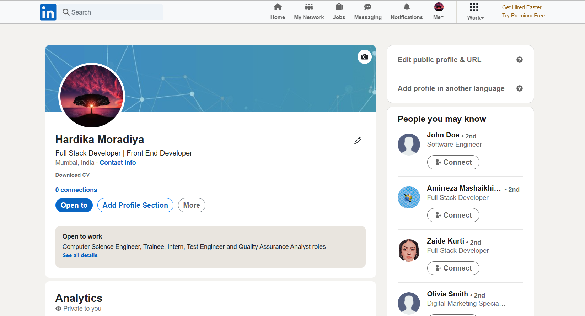

# LinkedIn Clone

This project aims to replicate some of the core features and functionality of the popular professional networking platform LinkedIn. It provides a platform for users to create profiles, Connect with other users by sending friend requests and accepting or ignoring requests, Create posts, including the ability to upload images.

## Key Features

- User profile creation and management, including the ability to update profile information
- Connect with other users by sending friend requests and accepting or ignoring requests
- Create posts, including the ability to upload images
- Like and comment on posts
- Search for profiles
- Notifications for new connections

## Images

